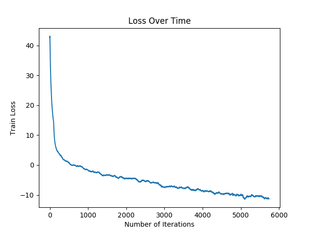

# NER using Bi-LSTM with CRF 

NER tagging using Bi-LSTM with batching.

## Training Loss

## Test Accuracy

Accuracy with only words: 0.8676181102362205
Accuracy with other features: 0.9626432345272403

